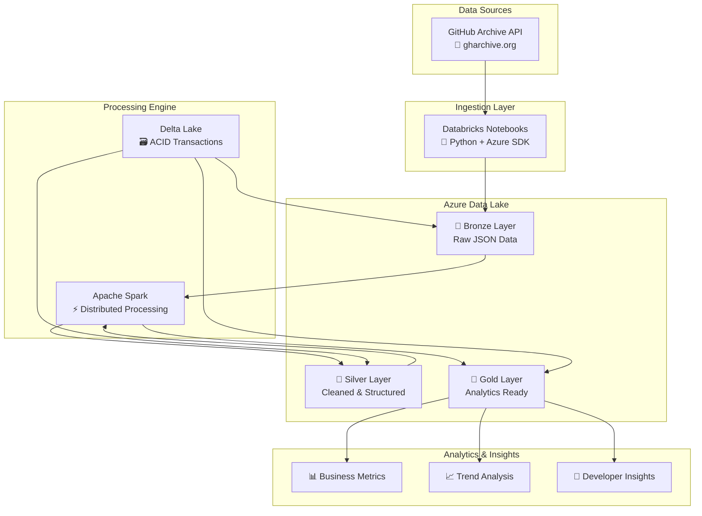

# Databricks GitHub Analytics Pipeline 🚀

[](https://databricks.com/)
[](https://azure.microsoft.com/)
[](https://python.org/)
[](https://spark.apache.org/)
[](https://docs.github.com/en/rest)

## 📋 Descripción del Proyecto

Pipeline completo de análisis de datos que procesa eventos de GitHub en tiempo real usando **Databricks**, **Azure Storage** y **Medallion Architecture**. Este proyecto implementa las mejores prácticas de Data Engineering para transformar datos en bruto de GitHub Archive en insights analíticos listos para consumo empresarial.

### 🎯 ¿Qué hace este pipeline?

- **Ingesta automática** de eventos de GitHub desde GitHub Archive
- **Procesamiento distribuido** usando Apache Spark en Databricks
- **Almacenamiento escalable** en Azure Data Lake (Bronze-Silver-Gold)
- **Transformaciones inteligentes** para análisis de patrones de desarrollo
- **Métricas de desarrolladores** y tendencias de repositorios
- **Dashboards interactivos** para visualización de insights

-----

## 🏗️ Arquitectura del Pipeline



-----

## 📊 Datos y Métricas

### 🔍 Eventos de GitHub Analizados

- **PushEvent** - Commits y contribuciones de código
- **PullRequestEvent** - Colaboración y code reviews
- **IssuesEvent** - Gestión de tareas y bugs
- **WatchEvent** - Popularidad de repositorios (stars)
- **ForkEvent** - Adopción y distribución de código
- **CreateEvent** - Creación de proyectos y branches

### 📈 Métricas Generadas

- **Actividad de desarrolladores** por región/timezone
- **Tendencias de lenguajes** de programación
- **Patrones de colaboración** en open source
- **Ranking de repositorios** más activos
- **Análisis temporal** de commits (horas/días)
- **Detección de proyectos** emergentes

### 📅 Volumen de Datos

- **~1.5M eventos/hora** en horarios pico
- **~20-50 MB** por archivo hourly
- **~500 GB/mes** de datos en bruto
- **Processing capacity:** Hasta 10GB/minuto

-----

## 🗓️ Guía de Implementación

### **Semana 1: Fundamentos y Capa Bronze** ✅

**[📖 Ir a la Guía Completa](./semana-1/README.md)**

#### 🎯 Objetivos:

- Configurar entorno Databricks Community Edition
- Integrar Azure Storage como Data Lake
- Implementar ingesta automática de datos
- Crear capa Bronze con datos en bruto

#### 🛠️ Tecnologías:

- Databricks Community Edition (Free)
- Azure Blob Storage
- Python + Azure SDK
- GitHub Archive API

#### ⏱️ Duración: 3-4 horas

-----

### **Semana 2: Transformaciones y Capa Silver** 🔄

**(Próximamente)**

#### 🎯 Objetivos:

- Limpiar y validar datos de GitHub
- Aplicar esquemas estructurados con Delta Lake
- Implementar transformaciones con PySpark
- Optimizar performance y particionado

#### 🛠️ Tecnologías:

- Apache Spark / PySpark
- Delta Lake
- Databricks SQL
- Data Quality validations

-----

### **Semana 3: Agregaciones y Capa Gold** 📊

**(Próximamente)**

#### 🎯 Objetivos:

- Crear métricas de negocio
- Implementar agregaciones temporales
- Construir tablas dimensionales
- Generar insights analíticos

#### 🛠️ Tecnologías:

- Spark SQL avanzado
- Time series analysis
- Statistical computing
- Business intelligence tables

-----

### **Semana 4: Automatización y Productivización** ⚙️

**(Próximamente)**

#### 🎯 Objetivos:

- Automatizar pipeline con Databricks Jobs
- Implementar monitoreo y alertas
- Configurar CI/CD para Data Engineering
- Deploying en entornos de producción

#### 🛠️ Tecnologías:

- Databricks Jobs & Workflows
- Azure DevOps / GitHub Actions
- Monitoring & Alerting
- Infrastructure as Code

-----

## 🚀 Inicio Rápido

### **Prerrequisitos**

- [ ] Cuenta [Azure](https://azure.microsoft.com/) con Storage Account
- [ ] Cuenta [Databricks Community Edition](https://community.cloud.databricks.com/) (gratuita)
- [ ] Permisos Azure: Storage Account Contributor + Storage Blob Data Contributor
- [ ] Python 3.8+ (incluido en Databricks)

### **🔧 Setup en 5 Pasos**

1. **Clonar el repositorio**
   
   ```bash
   git clone https://github.com/tu-usuario/databricks-github-analytics-pipeline.git
   cd databricks-github-analytics-pipeline
   ```
1. **Configurar Azure Storage**
- Crear Storage Account en Azure
- Obtener credenciales de acceso
- Configurar permisos necesarios
1. **Setup Databricks**
- Registrarse en Community Edition
- Crear clúster computacional
- Configurar Databricks Secrets
1. **Ejecutar Semana 1**
- Seguir guía paso a paso
- Implementar capa Bronze
- Validar ingesta de datos
1. **¡Analizar datos de GitHub!**
- Explorar eventos descargados
- Ejecutar primeras consultas
- Prepararse para transformaciones

**[🚀 Comenzar con Semana 1](./semana-1/README.md)**

-----

## 📁 Estructura del Proyecto

```
databricks-github-analytics-pipeline/
├── README.md                          # Este archivo
├── LICENSE                            # Licencia MIT
├── .gitignore                         # Archivos a ignorar
│
├── semana-1/                          # 🏗️ Fundamentos y Bronze
│   ├── README.md                      # Guía de la semana
│   ├── fase-1-configuracion.md       # Setup del entorno
│   ├── fase-2-capa-bronze.md         # Implementación Bronze
│   └── notebooks/
│       ├── 01_Setup_Azure_Storage.py
│       ├── 02_Ingesta_Bronze.py
│       └── 03_Validation_Bronze.py
│
├── semana-2/                          # 🔄 Transformaciones y Silver
│   ├── README.md
│   ├── transformaciones-pyspark.md
│   ├── esquemas-delta-lake.md
│   └── notebooks/
│       ├── 04_Limpieza_Datos.py
│       ├── 05_Esquemas_Estructurados.py
│       └── 06_Capa_Silver.py
│
├── semana-3/                          # 📊 Agregaciones y Gold
│   ├── README.md
│   ├── metricas-negocio.md
│   ├── analisis-temporal.md
│   └── notebooks/
│       ├── 07_Metricas_Desarrolladores.py
│       ├── 08_Tendencias_Repositorios.py
│       └── 09_Capa_Gold.py
│
├── semana-4/                          # ⚙️ Automatización
│   ├── README.md
│   ├── databricks-jobs.md
│   ├── ci-cd-pipeline.md
│   └── workflows/
│       ├── daily_ingestion.json
│       ├── weekly_aggregation.json
│       └── monitoring_alerts.json
│
└── recursos/                          # 📚 Recursos adicionales
    ├── diagramas/
    │   ├── arquitectura.png
    │   ├── flujo-datos.png
    │   └── medallion-architecture.png
    ├── templates/
    │   ├── azure-setup-template.json
    │   ├── databricks-config.yaml
    │   └── secrets-template.md
    ├── scripts/
    │   ├── setup_environment.sh
    │   ├── validate_permissions.py
    │   └── cleanup_resources.py
    └── docs/
        ├── troubleshooting.md
        ├── best-practices.md
        ├── performance-tuning.md
        └── security-guidelines.md
```

-----

## 💡 Casos de Uso

### 🏢 **Para Empresas**

- **Developer Productivity Analytics:** Medir eficiencia de equipos
- **Open Source Intelligence:** Identificar tecnologías emergentes
- **Talent Acquisition:** Encontrar desarrolladores activos
- **Competitive Analysis:** Analizar actividad de competidores

### 🎓 **Para Educación**

- **Learning Data Engineering:** Proyecto completo end-to-end
- **Cloud Technologies:** Práctica con Azure y Databricks
- **Big Data Processing:** Experiencia con Spark y Delta Lake
- **Portfolio Development:** Proyecto impresionante para CV

### 🔬 **Para Investigación**

- **Developer Behavior Analysis:** Patrones de contribución
- **Software Evolution Studies:** Análisis de tendencias
- **Collaboration Networks:** Mapeo de comunidades
- **Technology Adoption:** Velocidad de adopción de frameworks

-----

## 🛠️ Stack Tecnológico Completo

|Categoría         |Tecnología          |Propósito                |Nivel|
|------------------|--------------------|-------------------------|-----|
|**Compute**       |Databricks Community|Procesamiento distribuido|🔥🔥🔥🔥🔥|
|**Storage**       |Azure Blob Storage  |Data Lake escalable      |🔥🔥🔥🔥🔥|
|**Processing**    |Apache Spark/PySpark|Engine de Big Data       |🔥🔥🔥🔥⚪|
|**Storage Format**|Delta Lake          |ACID transactions        |🔥🔥🔥⚪⚪|
|**Language**      |Python              |Desarrollo principal     |🔥🔥🔥🔥🔥|
|**Data Source**   |GitHub Archive API  |Eventos de GitHub        |🔥🔥🔥⚪⚪|
|**Security**      |Databricks Secrets  |Gestión de credenciales  |🔥🔥🔥🔥⚪|
|**Orchestration** |Databricks Jobs     |Automatización           |🔥🔥🔥⚪⚪|

-----

## 📈 Roadmap del Proyecto

### **🎯 Versión 1.0** (Actual)

- [x] Configuración básica de entorno
- [x] Ingesta de datos GitHub Archive
- [x] Implementación Medallion Architecture
- [x] Documentación completa

### **🚀 Versión 2.0** (En desarrollo)

- [ ] Transformaciones avanzadas con PySpark
- [ ] Esquemas evolutivos con Delta Lake
- [ ] Métricas de calidad de datos
- [ ] Performance optimization

### **⚡ Versión 3.0** (Planificado)

- [ ] Streaming en tiempo real
- [ ] Machine Learning pipelines
- [ ] Advanced analytics dashboards
- [ ] Multi-cloud deployment

### **🌟 Versión 4.0** (Futuro)

- [ ] MLOps integration
- [ ] GraphQL API layer
- [ ] Real-time alerting system
- [ ] Enterprise security features

-----

## 🤝 Contribuir al Proyecto

### **🎯 Cómo Contribuir**

1. **Fork** el repositorio
1. **Crea** una rama feature (`git checkout -b feature/mejora-increible`)
1. **Commit** tus cambios (`git commit -m 'Add: mejora increible'`)
1. **Push** a la rama (`git push origin feature/mejora-increible`)
1. **Abre** un Pull Request

### **📝 Tipos de Contribuciones Bienvenidas**

- 🐛 **Bug fixes** y correcciones
- 📚 **Mejoras de documentación**
- ✨ **Nuevas features** y funcionalidades
- 🎨 **Optimizaciones** de performance
- 🧪 **Tests** y validaciones
- 🌍 **Traducciones** a otros idiomas

### **💬 Comunidad y Support**

- **[GitHub Issues](https://github.com/tu-usuario/databricks-github-analytics-pipeline/issues)** - Reportar bugs o pedir features
- **[GitHub Discussions](https://github.com/tu-usuario/databricks-github-analytics-pipeline/discussions)** - Preguntas y conversaciones
- **[Wiki](https://github.com/tu-usuario/databricks-github-analytics-pipeline/wiki)** - Documentación extendida

-----

## 📊 Estadísticas del Proyecto


-----

## 📄 Licencia

Este proyecto está bajo la Licencia MIT. Ver el archivo <LICENSE> para más detalles.

-----

## 🙏 Agradecimientos

- **[GitHub Archive](https://www.gharchive.org/)** por proporcionar datos públicos de GitHub
- **[Databricks](https://databricks.com/)** por la plataforma Community Edition gratuita
- **[Microsoft Azure](https://azure.microsoft.com/)** por los servicios de cloud computing
- **Comunidad Open Source** por inspiración y mejores prácticas

-----

## 📧 Contacto

- **Maintainer:** Tu Nombre
- **Email:** tu.email@example.com
- **LinkedIn:** [tu-perfil-linkedin](https://linkedin.com/in/tu-perfil)
- **Twitter:** [@tu_handle](https://twitter.com/tu_handle)

-----

<div align="center">

**🚀 ¡Comienza tu viaje en Data Engineering hoy mismo!**

**[📖 Ir a la Guía de la Semana 1](./semana-1/README.md)**

-----

⭐ **Si este proyecto te ha sido útil, ¡no olvides darle una estrella!** ⭐

</div>
