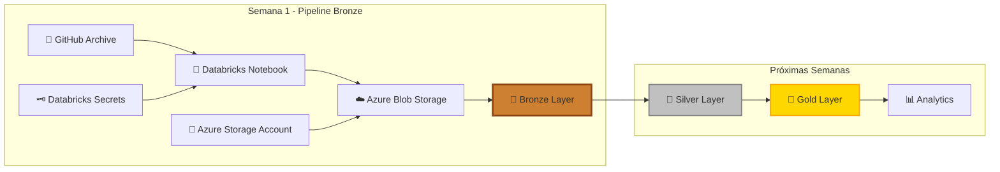

# **Semana 1: Configuración del Entorno y Creación de la Capa Bronze**

[](./fase-1-configuracion.md)
[](./fase-2-capa-bronze.md)
[](https://azure.microsoft.com/)
[](https://community.cloud.databricks.com/)

## **🎯 Objetivo de la Semana**

Al finalizar esta semana, habrás configurado tu entorno completo de Data Engineering y habrás construido tu primer pipeline de datos real. Tendrás un sistema funcional que descarga, procesa y almacena eventos de GitHub usando **Databricks** y **Azure Storage** con la arquitectura **Medallion (Bronze-Silver-Gold)**.

-----

## **📚 Contenido de la Semana**

### **[🔧 Fase 1: Configuración del Entorno](./fase-1-configuracion.md)**

**⏱️ Duración estimada:** 2-3 horas

#### **🛠️ Lo que vas a hacer:**

- ✅ Registrarte en Databricks Community Edition (gratuito)
- ✅ Configurar un clúster computacional
- ✅ Integrar Azure Storage Account como Data Lake
- ✅ Configurar Databricks Secrets para seguridad
- ✅ Crear la estructura Medallion Architecture

#### **🎓 Habilidades que desarrollarás:**

- Configuración de entornos cloud
- Gestión de credenciales seguras
- Integración de servicios Azure
- Conceptos de Data Lake y almacenamiento

-----

### **[📊 Fase 2: Carga y Almacenamiento (Capa Bronze)](./fase-2-capa-bronze.md)**

**⏱️ Duración estimada:** 1-2 horas

#### **🛠️ Lo que vas a hacer:**

- ✅ Crear tu primer notebook de Data Engineering
- ✅ Descargar datos reales de GitHub Archive
- ✅ Procesar archivos comprimidos (.gz)
- ✅ Cargar datos a Azure Storage (Capa Bronze)
- ✅ Validar y verificar la calidad de datos

#### **🎓 Habilidades que desarrollarás:**

- Ingesta automatizada de datos
- Manejo de APIs externas
- Procesamiento de archivos
- Validación de pipelines de datos

-----

## **🏗️ Arquitectura que Vas a Construir**



### **🎯 Enfoque de la Semana 1:**

- **🥉 Bronze Layer:** Datos en formato original/crudo
- **📦 Almacenamiento:** Azure Blob Storage como Data Lake
- **🔄 Procesamiento:** Descarga y carga automatizada
- **🛡️ Seguridad:** Credenciales protegidas con Secrets

-----

## **📊 Datos del Proyecto**

### **🔍 Fuente de Datos: GitHub Archive**

- **URL:** [gharchive.org](https://www.gharchive.org/)
- **Contenido:** Eventos públicos de GitHub cada hora
- **Formato:** JSON comprimido (.gz)
- **Volumen:** ~10-50 MB por archivo

### **📅 Datos de Esta Semana:**

- **Período:** 2 días (01-01-2025 y 02-01-2025)
- **Horas por día:** 3 horas (0:00, 1:00, 2:00)
- **Total archivos:** 6 archivos JSON
- **Volumen total:** ~60-300 MB

### **🎯 Tipos de Eventos GitHub:**

|Evento              |Descripción               |Frecuencia|
|--------------------|--------------------------|----------|
|**PushEvent**       |Commits subidos a repos   |🔥🔥🔥🔥🔥     |
|**CreateEvent**     |Creación de repos/branches|🔥🔥🔥⚪⚪     |
|**PullRequestEvent**|Pull requests             |🔥🔥🔥🔥⚪     |
|**IssuesEvent**     |Issues y comentarios      |🔥🔥🔥⚪⚪     |
|**WatchEvent**      |Stars en repositorios     |🔥🔥🔥🔥⚪     |
|**ForkEvent**       |Forks de repositorios     |🔥🔥⚪⚪⚪     |

-----

## **🚀 Guía de Inicio Rápido**

### **📋 Prerrequisitos**

- [ ] **Cuenta Azure** con Storage Account
- [ ] **Permisos Azure:** Storage Account Contributor + Storage Blob Data Contributor
- [ ] **Navegador web** actualizado
- [ ] **Conexión a internet** estable
- [ ] **2-4 horas** de tiempo disponible

### **🔄 Flujo de Trabajo**

1. **🔧 [Comenzar con Fase 1](./fase-1-configuracion.md)**
- Configurar Databricks y Azure Storage
- Crear secrets y estructura del proyecto
1. **📊 [Continuar con Fase 2](./fase-2-capa-bronze.md)**
- Implementar ingesta de datos
- Cargar datos a la capa Bronze
1. **✅ Verificar resultados**
- Validar datos en Azure Portal
- Confirmar pipeline funcionando
1. **🎯 Prepararse para Semana 2**
- Datos listos para transformación
- Entorno configurado completamente

-----

## **📝 Checklist de Progreso Semanal**

### **🔧 Fase 1: Configuración del Entorno**

- [ ] **Databricks Community Edition**
  - [ ] Cuenta creada y verificada por email
  - [ ] Workspace accesible y explorado
  - [ ] Interfaz principal navegada
- [ ] **Clúster Computacional**
  - [ ] Clúster `cluster-proyecto-github` creado
  - [ ] Runtime LTS más reciente seleccionado
  - [ ] Estado activo confirmado (círculo verde)
- [ ] **Azure Storage Account**
  - [ ] Grupo de recursos `rg-proyecto-github` accedido
  - [ ] Permisos verificados en Azure Portal
  - [ ] Storage Account identificado y accedido
  - [ ] Credenciales obtenidas (nombre + clave)
- [ ] **Databricks Secrets**
  - [ ] Scope `azure-storage-secrets` creado
  - [ ] Secret `storage-account-name` agregado
  - [ ] Secret `storage-account-key` agregado
  - [ ] Conexión probada exitosamente
- [ ] **Estructura Medallion**
  - [ ] Contenedor `alopez-proyecto-gh` creado
  - [ ] Carpeta `bronze/` implementada
  - [ ] Carpeta `silver/` preparada
  - [ ] Carpeta `gold/` preparada

### **📊 Fase 2: Capa Bronze**

- [ ] **Notebook de Ingesta**
  - [ ] Carpeta `Proyecto-GitHub-Analytics` creada
  - [ ] Notebook `01_Ingesta_Bronze_Azure` creado
  - [ ] Clúster adjuntado correctamente
- [ ] **Configuración del Pipeline**
  - [ ] Librerías de Azure instaladas
  - [ ] Cliente de storage configurado
  - [ ] Funciones utilitarias implementadas
  - [ ] URLs de GitHub Archive configuradas
- [ ] **Proceso de Ingesta**
  - [ ] Descarga automática funcionando
  - [ ] Descompresión de archivos .gz
  - [ ] Carga a Azure Storage exitosa
  - [ ] 6 archivos procesados correctamente
- [ ] **Validación y Verificación**
  - [ ] Archivos visibles en Azure Portal
  - [ ] Contenido JSON validado
  - [ ] Estadísticas de archivos obtenidas
  - [ ] Rutas preparadas para siguiente notebook

-----

## **🎓 Conocimientos y Habilidades Adquiridas**

### **💡 Conceptos de Data Engineering**

- **📊 Medallion Architecture:** Comprensión de capas Bronze-Silver-Gold
- **🏗️ Data Lake:** Diseño de almacenamiento escalable
- **🔄 ETL Pipelines:** Procesos Extract-Transform-Load
- **🛡️ Data Security:** Gestión segura de credenciales

### **🛠️ Habilidades Técnicas**

- **☁️ Cloud Computing:** Azure Storage y Databricks
- **🐍 Python:** Programación para Data Engineering
- **📦 APIs:** Integración con servicios externos
- **🔧 DevOps:** Configuración de entornos de desarrollo

### **🏢 Aplicaciones Empresariales**

- **📈 Data Ingestion:** Procesos de carga masiva de datos
- **🔍 Data Validation:** Verificación de calidad de datos
- **⚙️ Automation:** Automatización de tareas repetitivas
- **📊 Analytics Foundation:** Base para análisis avanzados

-----

## **📁 Estructura de Archivos de la Semana**

```
semana-1/
├── README.md                          # 📖 Esta guía
├── fase-1-configuracion.md           # 🔧 Setup del entorno
├── fase-2-capa-bronze.md             # 📊 Implementación Bronze
│
└── notebooks/                        # 📓 Notebooks para Databricks
    ├── 01_Setup_Azure_Storage.py     # Configuración inicial
    ├── 02_Ingesta_Bronze.py          # Pipeline de ingesta
    └── 03_Validation_Bronze.py       # Validación de datos
```

-----

## **🔍 Troubleshooting y Soporte**

### **❓ Problemas Comunes y Soluciones**

|**Problema**                 |**Síntoma**           |**Solución**                             |
|-----------------------------|----------------------|-----------------------------------------|
|**Error autenticación Azure**|“Access denied”       |Verificar permisos IAM en Azure Portal   |
|**Secrets no encontrados**   |“Secret not found”    |Recrear scope y secrets en Databricks    |
|**Clúster no inicia**        |“Starting…” prolongado|Reintentar creación con runtime diferente|
|**Error descarga datos**     |“Network timeout”     |Verificar conectividad y URLs de GitHub  |
|**Archivos no aparecen**     |Azure Storage vacío   |Revisar proceso de carga y credenciales  |

### **🆘 Dónde Buscar Ayuda**

- **📋 Logs Databricks:** Cluster → Logs → Driver Logs
- **☁️ Azure Portal:** Storage Account → Monitoring → Metrics
- **📚 Documentación:** Enlaces en cada fase
- **💬 GitHub Issues:** Reportar problemas del proyecto

-----

## **📈 Preparación para Semana 2**

### **🎯 Vista Previa: Transformaciones y Capa Silver**

- **Objetivo:** Limpiar y estructurar datos de GitHub
- **Tecnologías:** PySpark, Delta Lake, Esquemas
- **Duración:** 3-4 horas
- **Prerrequisito:** Semana 1 completada exitosamente

### **🔥 Lo que viene:**

- Aplicación de esquemas estructurados
- Transformaciones avanzadas con PySpark
- Limpieza y validación de datos JSON
- Optimización de performance y particionado
- Preparación de datos para análisis

-----

## **📚 Recursos de Aprendizaje**

### **📖 Documentación Oficial**

- [**Databricks Community Edition**](https://docs.databricks.com/getting-started/community-edition.html)
- [**Azure Blob Storage Python SDK**](https://docs.microsoft.com/en-us/azure/storage/blobs/storage-quickstart-blobs-python)
- [**GitHub Archive Documentation**](https://www.gharchive.org/)
- [**Medallion Architecture Guide**](https://databricks.com/glossary/medallion-architecture)

### **🎥 Videos Recomendados**

- Databricks Community Edition Setup
- Azure Storage Account Configuration
- Introduction to Data Lakes
- Python for Data Engineering

### **📝 Artículos Complementarios**

- Best Practices for Data Ingestion
- Cloud Security for Data Engineers
- JSON Data Processing Techniques
- Modern Data Architecture Patterns

-----

## **🏆 Certificación de Completitud**

Al finalizar esta semana exitosamente, habrás:

✅ **Configurado un entorno profesional** de Data Engineering  
✅ **Implementado tu primer pipeline** de datos real  
✅ **Trabajado con tecnologías enterprise** (Azure + Databricks)  
✅ **Procesado datos del mundo real** (GitHub Archive)  
✅ **Aplicado mejores prácticas** de seguridad y arquitectura

### **🎖️ Habilidades Validadas:**

- **Cloud Data Engineering** con Azure y Databricks
- **Pipeline Development** con Python
- **Data Lake Architecture** con Medallion pattern
- **API Integration** y data ingestion
- **Security Best Practices** con secrets management

-----

## **🚀 ¿Listo para Empezar?**

### **📍 Tu Próximo Paso:**

<div align="center">

**[🔧 Comenzar con Fase 1: Configuración del Entorno](./fase-1-configuracion.md)**

*Tiempo estimado: 2-3 horas*

-----

**💡 Consejo:** Dedica tiempo suficiente a cada fase y no tengas prisa. La configuración correcta del entorno es crucial para el éxito de todo el proyecto.

</div>

-----

**[⬅️ Regresar al Proyecto Principal](../README.md)** | **[➡️ Ir a Fase 1](./fase-1-configuracion.md)**

