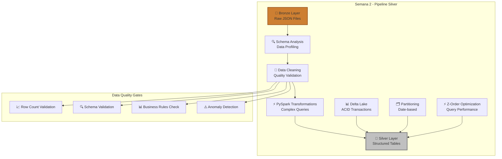

# **Semana 2: Transformaciones de Datos y Creación de la Capa Silver**

[](./fase-1-esquemas-limpieza.md)
[](./fase-2-transformaciones-pyspark.md)
[](./fase-3-capa-silver.md)
[](https://spark.apache.org/)
[](https://delta.io/)

## **🎯 Objetivo de la Semana**

Transformar los datos en bruto de GitHub (Capa Bronze) en datos limpios, estructurados y optimizados para análisis (Capa Silver). Aprenderás las técnicas fundamentales de **Data Engineering** usando **PySpark**, **Delta Lake** y **esquemas evolutivos** para crear pipelines de transformación robustos y escalables.

---

## **📚 Contenido de la Semana**

### **[🔧 Fase 1: Esquemas y Limpieza de Datos](./fase-1-esquemas-limpieza.md)**
**⏱️ Duración estimada:** 2-3 horas

#### **🛠️ Lo que vas a hacer:**
- ✅ Analizar la estructura de datos JSON de GitHub Archive
- ✅ Definir esquemas PySpark para eventos de GitHub
- ✅ Implementar validaciones de calidad de datos
- ✅ Limpiar y normalizar campos inconsistentes
- ✅ Manejar valores nulos y datos corruptos

#### **🎓 Habilidades que desarrollarás:**
- Análisis exploratorio de datos (EDA) con PySpark
- Definición de esquemas estructurados
- Técnicas de limpieza de datos
- Validaciones de Data Quality
- Manejo de datos semi-estructurados (JSON)

---

### **[⚡ Fase 2: Transformaciones Avanzadas con PySpark](./fase-2-transformaciones-pyspark.md)**
**⏱️ Duración estimada:** 3-4 horas

#### **🛠️ Lo que vas a hacer:**
- ✅ Transformar eventos JSON en tablas relacionales
- ✅ Extraer información de payloads complejos
- ✅ Crear dimensiones de tiempo (timestamp parsing)
- ✅ Normalizar datos de usuarios y repositorios
- ✅ Implementar transformaciones avanzadas con SQL

#### **🎓 Habilidades que desarrollarás:**
- PySpark DataFrames y SQL avanzado
- Transformaciones de datos complejas
- Parsing de timestamps y fechas
- Normalización de datos
- Optimización de queries distribuidas

---

### **[🥈 Fase 3: Implementación de la Capa Silver](./fase-3-capa-silver.md)**
**⏱️ Duración estimada:** 2-3 horas

#### **🛠️ Lo que vas a hacer:**
- ✅ Configurar Delta Lake para ACID transactions
- ✅ Crear tablas Silver particionadas por fecha
- ✅ Implementar merge/upsert operations
- ✅ Optimizar storage con Z-Order clustering
- ✅ Crear pipeline de transformación automatizado

#### **🎓 Habilidades que desarrollarás:**
- Delta Lake para lakehouse architecture
- Particionado eficiente de datos
- Operaciones ACID en data lakes
- Optimización de storage y queries
- Pipelines de transformación escalables

---

## **🏗️ Arquitectura que Vas a Construir**



### **🎯 Enfoque de la Semana 2:**
- **🥈 Silver Layer:** Datos limpios y estructurados
- **⚡ PySpark:** Transformaciones distribuidas
- **🗃️ Delta Lake:** Storage optimizado con ACID
- **📊 Data Quality:** Validaciones y métricas

---

## **📊 Transformaciones de Datos**

### **🔍 Análisis de Eventos GitHub (Input):**
```json
{
  "id": "12345678901",
  "type": "PushEvent",
  "actor": {
    "id": 123456,
    "login": "octocat",
    "display_login": "octocat"
  },
  "repo": {
    "id": 654321,
    "name": "octocat/Hello-World"
  },
  "created_at": "2025-01-01T00:00:00Z",
  "payload": {
    "commits": [
      {
        "sha": "abc123def456...",
        "message": "Update README.md"
      }
    ]
  }
}
```

### **🥈 Tabla Silver Resultante (Output):**
| event_id | event_type | user_id | username | repo_id | repo_name | event_date | hour | commits_count | main_language |
|----------|------------|---------|----------|---------|-----------|------------|------|---------------|---------------|
| 12345678901 | PushEvent | 123456 | octocat | 654321 | octocat/Hello-World | 2025-01-01 | 0 | 1 | Python |

### **📈 Métricas de Transformación:**
- **Reducción de volumen:** ~40-60% (JSON → Columnar)
- **Mejora de queries:** 10-50x más rápido
- **Data quality:** 99%+ eventos válidos
- **Particionado:** Por fecha para queries eficientes

---

## **🚀 Tecnologías de la Semana**

### **🛠️ Stack Tecnológico Principal:**

| Tecnología | Propósito | Nivel de Uso |
|------------|-----------|--------------|
| **PySpark** | Engine de transformaciones distribuidas | 🔥🔥🔥🔥🔥 |
| **Delta Lake** | Storage format con ACID transactions | 🔥🔥🔥🔥⚪ |
| **Spark SQL** | Queries y transformaciones declarativas | 🔥🔥🔥🔥⚪ |
| **Python** | Desarrollo de transformaciones custom | 🔥🔥🔥🔥🔥 |
| **JSON Parsing** | Extracción de datos semi-estructurados | 🔥🔥🔥⚪⚪ |
| **Schema Evolution** | Manejo de cambios en estructura | 🔥🔥🔥⚪⚪ |

### **📊 Conceptos Clave:**
- **DataFrames vs RDDs:** Cuándo usar cada uno
- **Catalyst Optimizer:** Optimización automática de queries
- **Partitioning Strategies:** Distribución eficiente de datos
- **Data Skew:** Detección y mitigación de desbalances
- **Broadcast Joins:** Optimización de joins pequeños

---

## **🚀 Guía de Inicio Rápido**

### **📋 Prerrequisitos de la Semana 2**
- [ ] **Semana 1 completada** exitosamente
- [ ] **Datos en capa Bronze** disponibles en Azure Storage
- [ ] **Databricks Serverless Warehouse** activo
- [ ] **Azure Storage** configurado y accesible
- [ ] **Conocimientos básicos** de SQL (recomendado)

### **🔄 Flujo de Trabajo Semana 2**

1. **🔍 [Comenzar con Fase 1](./fase-1-esquemas-limpieza.md)**
   - Analizar datos Bronze existentes
   - Definir esquemas y validaciones

2. **⚡ [Continuar con Fase 2](./fase-2-transformaciones-pyspark.md)**
   - Implementar transformaciones complejas
   - Optimizar performance de queries

3. **🥈 [Finalizar con Fase 3](./fase-3-capa-silver.md)**
   - Crear tablas Silver con Delta Lake
   - Automatizar pipeline de transformación

4. **✅ Verificar resultados**
   - Validar calidad de datos Silver
   - Confirmar optimizaciones de performance

---

## **📝 Checklist de Progreso Semanal**

### **🔍 Fase 1: Esquemas y Limpieza**
- [ ] **Análisis Exploratorio de Datos**
  - [ ] Datos Bronze cargados en DataFrames
  - [ ] Estructura JSON analizada y documentada
  - [ ] Esquemas PySpark definidos por tipo de evento
  - [ ] Estadísticas básicas calculadas

- [ ] **Limpieza y Validación**
  - [ ] Registros corruptos identificados y removidos
  - [ ] Campos nulos manejados apropiadamente
  - [ ] Validaciones de data quality implementadas
  - [ ] Transformaciones de limpieza aplicadas

### **⚡ Fase 2: Transformaciones PySpark**
- [ ] **Transformaciones Core**
  - [ ] Eventos JSON parseados a columnas estructuradas
  - [ ] Timestamps convertidos a tipos de fecha
  - [ ] Payloads complejos extraídos (commits, issues, etc.)
  - [ ] Campos calculados agregados (hour, day_of_week, etc.)

- [ ] **Normalización de Datos**
  - [ ] Información de usuarios normalizada
  - [ ] Datos de repositorios estructurados
  - [ ] Métricas de eventos calculadas
  - [ ] Transformaciones SQL avanzadas aplicadas

### **🥈 Fase 3: Capa Silver**
- [ ] **Configuración Delta Lake**
  - [ ] Delta Lake habilitado en Azure Storage
  - [ ] Tablas Silver creadas con esquemas apropiados
  - [ ] Particionado por fecha implementado
  - [ ] Z-Order clustering configurado

- [ ] **Pipeline de Transformación**
  - [ ] Proceso ETL automatizado Bronze → Silver
  - [ ] Operaciones merge/upsert funcionando
  - [ ] Validaciones de calidad en pipeline
  - [ ] Métricas de performance documentadas

- [ ] **Validación Final**
  - [ ] Datos Silver verificados en Azure Portal
  - [ ] Queries de ejemplo ejecutadas exitosamente
  - [ ] Performance comparado con Bronze
  - [ ] Pipeline listo para automatización

---

## **🎓 Conocimientos y Habilidades Adquiridas**

### **💡 Conceptos de Data Engineering Avanzados**
- **🏗️ Lakehouse Architecture:** Combinación de data lakes y data warehouses
- **🔄 ETL vs ELT:** Diferencias y cuándo usar cada enfoque
- **📊 Data Quality Engineering:** Métricas, validaciones y monitoreo
- **⚡ Distributed Computing:** Paralelización y optimización de workloads

### **🛠️ Habilidades Técnicas Específicas**
- **🐍 PySpark Avanzado:** DataFrames, SQL, y optimizaciones
- **🗃️ Delta Lake:** ACID transactions, time travel, schema evolution
- **📈 Performance Tuning:** Partitioning, caching, broadcasting
- **🔍 Data Profiling:** Análisis estadístico y detección de anomalías

### **🏢 Aplicaciones Empresariales**
- **📊 Data Pipeline Design:** Arquitectura de pipelines escalables
- **🔧 Data Transformation:** Técnicas de limpieza y normalización
- **📈 Performance Optimization:** Queries eficientes en big data
- **🛡️ Data Governance:** Calidad, linaje y documentación

---

## **🔍 Casos de Uso de la Semana**

### **📊 Análisis que Habilitarás:**
- **Developer Activity Patterns:** Análisis temporal de commits
- **Repository Trends:** Tendencias de popularidad y actividad
- **Language Analytics:** Distribución y evolución de lenguajes
- **Collaboration Networks:** Patrones de contribución entre usuarios

### **🎯 Métricas que Crearás:**
- **Commits por hora/día/mes** para análisis temporal
- **Actividad por repositorio** para ranking de popularidad
- **Contribuciones por desarrollador** para análisis de productividad
- **Eventos por tipo** para entender patrones de uso de GitHub

---

## **🔍 Troubleshooting y Soporte**

### **❓ Problemas Comunes y Soluciones**

| **Problema** | **Síntoma** | **Solución** |
|--------------|-------------|--------------|
| **JSON parsing errors** | "Malformed JSON" | Implementar try-catch y logging robusto |
| **Schema evolution issues** | "Column not found" | Usar schema merging y campos opcionales |
| **Performance lento** | Queries toman mucho tiempo | Revisar partitioning y optimizar joins |
| **Memory errors** | "OutOfMemory exception" | Ajustar configuración de Spark y partitioning |
| **Delta Lake errors** | "Concurrent modification" | Implementar retry logic y optimistic concurrency |

### **🆘 Dónde Buscar Ayuda**
- **📋 Spark UI:** Análisis de jobs y stages
- **🔍 Delta Lake Logs:** Monitoring de transacciones
- **📚 Documentación:** Enlaces específicos en cada fase
- **💬 GitHub Issues:** Reportar problemas del proyecto

---

## **📈 Preparación para Semana 3**

### **🎯 Vista Previa: Agregaciones y Capa Gold**
- **Objetivo:** Crear métricas de negocio y tablas analíticas
- **Tecnologías:** Spark SQL avanzado, Window functions, Aggregations
- **Duración:** 3-4 horas
- **Prerrequisito:** Semana 2 completada con datos Silver funcionando

### **🔥 Lo que viene:**
- Agregaciones temporales (daily, weekly, monthly)
- Métricas de negocio avanzadas
- Tablas dimensionales para BI
- Optimización para consultas analíticas
- Preparación de datos para dashboards

---

## **📚 Recursos de Aprendizaje**

### **📖 Documentación Oficial**
- [**PySpark Documentation**](https://spark.apache.org/docs/latest/api/python/)
- [**Delta Lake Guide**](https://docs.delta.io/latest/index.html)
- [**Databricks PySpark Reference**](https://docs.databricks.com/pyspark/index.html)
- [**Spark SQL Guide**](https://spark.apache.org/docs/latest/sql-programming-guide.html)

### **🎥 Videos Recomendados**
- PySpark DataFrames Deep Dive
- Delta Lake Architecture Overview
- Spark Performance Tuning
- Data Quality Best Practices

### **📝 Artículos Complementarios**
- Medallion Architecture Implementation
- JSON Processing at Scale
- Data Partitioning Strategies
- Modern ETL Design Patterns

---

## **🏆 Certificación de Completitud Semana 2**

Al finalizar esta semana exitosamente, habrás:

✅ **Dominado PySpark** para transformaciones distribuidas  
✅ **Implementado Delta Lake** para storage optimizado  
✅ **Creado pipelines ETL** robustos y escalables  
✅ **Aplicado data quality** engineering  
✅ **Optimizado performance** de queries en big data  

### **🎖️ Habilidades Validadas:**
- **Advanced Data Engineering** con PySpark y Delta Lake
- **ETL Pipeline Development** para producción
- **Data Quality Engineering** y validaciones
- **Performance Optimization** en sistemas distribuidos
- **Lakehouse Architecture** implementation

---

## **🚀 ¿Listo para Empezar?**

### **📍 Tu Próximo Paso:**

<div align="center">

**[🔍 Comenzar con Fase 1: Esquemas y Limpieza](./fase-1-esquemas-limpieza.md)**

*Tiempo estimado: 2-3 horas*

---

**💡 Consejo:** Esta semana es más técnica que la anterior. Tómate tu tiempo para entender cada concepto antes de avanzar. La calidad de tu capa Silver determinará el éxito de todas las semanas siguientes.

</div>

---

**[⬅️ Regresar a Semana 1](../semana-1/README.md)** | **[➡️ Ir a Fase 1](./fase-1-esquemas-limpieza.md)** | **[🏠 Proyecto Principal](../README.md)**