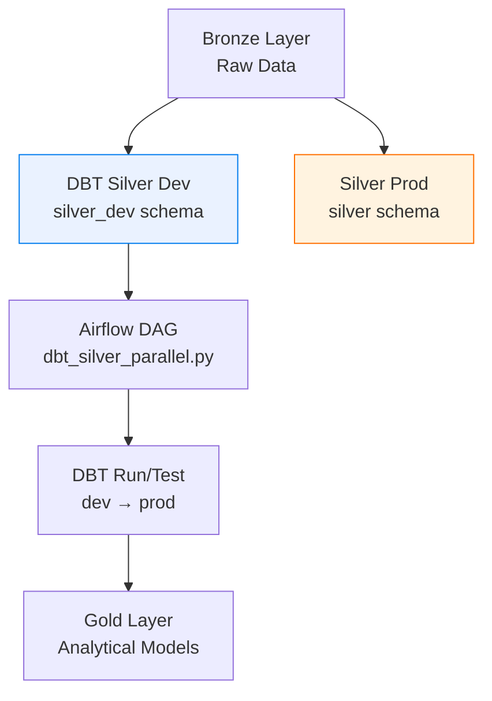

# 🧱 Databricks Silver Dev Orchestration con DBT + Airflow

[](https://databricks.com/)
[](https://airflow.apache.org/)
[](https://www.getdbt.com/)
[](https://spark.apache.org/)
[](https://python.org/)

---

## 📋 Descripción del Proyecto

Este módulo amplía el proyecto de **arquitectura medallón en Databricks** (Bronze–Silver–Gold), agregando una **capa paralela de desarrollo (Silver Dev)** orquestada con **Airflow y DBT (Data Build Tool)**.

El objetivo es permitir a los equipos de datos ejecutar y validar sus transformaciones **en un entorno aislado** (`silver_dev`) antes de promover los cambios al entorno **productivo (`silver`)**, siguiendo buenas prácticas de versionado, testing y CI/CD para pipelines analíticos.

---

## 🎯 Objetivos

- Crear un **entorno Silver paralelo** para desarrollo (`silver_dev`)
- Configurar **DBT con Databricks** como motor de ejecución (adapter oficial)
- Orquestar la ejecución de los modelos DBT con **Apache Airflow**
- Mantener aisladas las rutas, catálogos y esquemas de `silver` y `silver_dev`
- Facilitar **pruebas automatizadas** y **promoción controlada** a producción

---

## 🏗️ Arquitectura General



**Resumen:**  
Los notebooks actuales siguen generando y transformando las capas Bronze y Silver (producción).  
DBT se encarga de **replicar y probar las transformaciones Silver** en un entorno paralelo, mientras Airflow coordina la ejecución secuencial: `dev` → validación → `prod`.

---

## ⚙️ Componentes Clave

| Componente | Descripción | Propósito |
|-------------|--------------|------------|
| **DBT (dbt-databricks)** | Framework de modelado SQL modular | Define y ejecuta transformaciones de datos |
| **Apache Airflow** | Orquestador de pipelines | Coordina tareas `dbt run` y `dbt test` |
| **Databricks Delta Lake** | Formato de almacenamiento ACID | Mantiene las tablas de Silver y Silver Dev |
| **Python / BashOperator** | Ejecución de comandos DBT en Airflow | Ejecuta y valida jobs de dbt |

---

## 🧩 Estructura del Proyecto

```
databricks-silver-dev-orchestration/
├── DBT_Silver_Dev_Orchestration.ipynb   # Guía principal paso a paso
├── dags/
│   └── airflow_dag_dbt_silver.py        # DAG de Airflow para ejecutar dbt (dev→prod)
├── dbt_templates/
│   ├── profiles.yml.example             # Configuración de targets (prod/dev)
│   ├── dbt_project.yml.example          # Proyecto base dbt
│   └── models/
│       └── silver_example.sql           # Modelo incremental de ejemplo
└── README.md                            # Este archivo
```

---

## 🧰 Requisitos Previos

- Workspace de **Databricks** con acceso a un Warehouse o Cluster activo  
- **Python 3.8+** y acceso a instalar paquetes (`pip`)  
- **Apache Airflow** operativo (local o en servidor)  
- **Token de Databricks** con permisos de escritura sobre el schema `silver_dev`
- Credenciales configuradas en variables de entorno:
  ```bash
  export DATABRICKS_TOKEN="***"
  export DBT_PROFILES_DIR="/ruta/a/tu/dbt_project"
  export DBT_PROJECT_DIR="/ruta/a/tu/dbt_project"
  ```

---

## 🚀 Setup Paso a Paso

### 1️⃣ Instalar dependencias

```bash
pip install dbt-databricks apache-airflow
```

### 2️⃣ Configurar `profiles.yml`

Define dos entornos (`dev` y `prod`) con sus respectivos esquemas:

```yaml
databricks_project:
  target: dev
  outputs:
    prod:
      type: databricks
      catalog: main
      schema: silver
      host: https://<workspace>.cloud.databricks.com
      http_path: /sql/1.0/warehouses/<WAREHOUSE_ID>
      token: "{{ env_var('DATABRICKS_TOKEN') }}"
    dev:
      type: databricks
      catalog: main
      schema: silver_dev
      host: https://<workspace>.cloud.databricks.com
      http_path: /sql/1.0/warehouses/<WAREHOUSE_ID>
      token: "{{ env_var('DATABRICKS_TOKEN') }}"
```

### 3️⃣ Crear proyecto DBT

```bash
dbt init databricks_silver
cp dbt_templates/dbt_project.yml.example dbt_project.yml
```

### 4️⃣ Validar conexión

```bash
dbt debug --target dev
```

### 5️⃣ Ejecutar transformaciones

- En entorno desarrollo:
  ```bash
  dbt run --select tag:silver --target dev
  dbt test --select tag:silver --target dev
  ```
- En producción:
  ```bash
  dbt run --select tag:silver --target prod
  dbt test --select tag:silver --target prod
  ```

---

## 🌀 Orquestación con Airflow

El DAG `airflow_dag_dbt_silver.py` automatiza la secuencia:

1. Limpieza (`dbt clean`)  
2. Ejecución en `dev` (`dbt run/test`)  
3. Promoción a `prod` sólo si pasa la validación  

```bash
cd dags/
airflow dags list
airflow dags trigger dbt_silver_parallel
```

---

## 🧠 Buenas Prácticas

- Mantén el **aislamiento entre `silver_dev` y `silver`** (distinto schema/catalog).
- Usa **tags** para segmentar modelos (`tag:silver`, `tag:gold`, etc.).
- Agrega **tests DBT** (`unique`, `not_null`, `relationships`) en cada modelo.
- Versiona tus cambios con **Git + Pull Requests**.
- Automatiza ejecución y despliegues con Airflow o Databricks Jobs.

---

## 📈 Roadmap

| Fase | Objetivo | Estado |
|------|-----------|--------|
| 1 | Configurar entorno DBT + Silver Dev | ✅ |
| 2 | Integrar Airflow para orquestación diaria | ✅ |
| 3 | Añadir CI/CD con GitHub Actions | 🔄 |
| 4 | Incorporar validaciones automáticas y alertas | 🔜 |
| 5 | Extender a Gold con DBT | 🔜 |

---

## 🤝 Contribuir

1. **Fork** del repo  
2. **Crea** tu rama (`feature/dbt-upgrade`)  
3. **Commit & push**  
4. **Pull request** con descripción clara  

---

## 📄 Licencia

Este proyecto se distribuye bajo licencia **MIT**.  
Siente total libertad para reutilizar, adaptar y mejorar el código. eso si, pilas con compartir Keys o Secret values

---

## ✉️ Contacto

**Autor:** Sebastian Clavijo Correa  
**Rol:** Data Engineer / Miembro comunidad Databricks   
**LinkedIn:** [linkedin.com/in/Sebastian Clavijo Correa](https://linkedin.com/in/tatan](https://www.linkedin.com/in/sebastian-clavijo-correa-446421287))

---

<div align="center">

✨ *Silver Dev es tu sandbox seguro: experimenta, valida y escala sin romper producción.* ✨  
**— Equipo de Ingeniería de Datos —**

</div>
